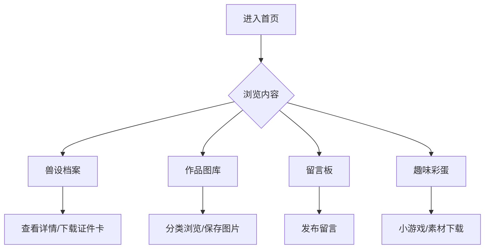

## 1. Product Overview

Furry 个人展示站点，为兽圈爱好者提供完整的角色档案展示、作品图库、社交互动平台。采用柔和马卡龙配色与透明磨砂设计，打造温馨舒适的视觉体验。

## 2. Core Features

### 2.1 User Roles

| Role    | Registration Method | Core Permissions                          |
| ------- | ------------------- | ----------------------------------------- |
| Visitor | None                | Browse all public content, leave messages |
| Admin   | Local login         | Manage content, approve messages          |

### 2.2 Feature Module

1. **首页**: 轮播大图、自我介绍、快捷导航、动态背景彩蛋
2. **兽设档案页**: 完整角色设定、基础信息、细节设定、性格喜好、世界观、参考图集、证件风兽设卡
3. **作品图库**: 分类管理（OC插画、兽装实拍、表情包、同人、手绘）

    
4. **日常随笔**: OC日记、漫展记录、小故事连载
5. **交友亲友墙**: 亲友展示、贴贴插画、感谢板块
6. **留言板**: 访客留言、图片留言、管理员置顶
7. **约稿专区**: 价目表、例图展示、流程规则、排单进度

    

### 2.3 Page Details  所有功能可以由管理员进行关闭/打开

| Page Name | Module Name | Feature description     |
| --------- | ----------- | ----------------------- |
| 首页        | Hero轮播      | 自动轮播好友兽设立绘/全身插画/兽装实拍    |
| 首页        | 自我介绍        | 兽名、物种、性别、性格、爱好、入坑时间     |
| 首页        | 快捷导航        | 跳转到各功能模块                |
| 首页        | 彩蛋          | 浮动Q版光标、动态飘毛/星星背景、背景音乐   |
| 兽设档案      | 基础信息        | 兽名、物种、年龄、身高、毛色、瞳色、花纹、配饰 |
| 兽设档案      | 细节设定        | 爪垫、尾巴、角、翅膀、伤疤、特殊标记      |
| 兽设档案      | 性格喜好        | 喜欢/讨厌、作息、小习惯            |
| 兽设档案      | 世界观         | OC小故事、身份设定              |
| 兽设档案      | 禁忌红线        | 不接受魔改的部位、禁止二创           |
| 兽设档案      | 参考图集        | 全身立绘、半身、Q版、细节特写         |
| 兽设档案      | 证件卡片        | 可下载高清兽设证件图              |
| 作品图库      | OC插画        | 约稿、无偿、互绘、赠图分类           |
| 作品图库      | 兽装实拍        | 外出、室内、局部细节              |
| 作品图库      | 表情包         | 静态表情、动态GIF              |
| 作品图库      | 同人合拍        | 双人OC插画、贴贴图              |
| 作品图库      | 手绘草稿        | 线稿、速写、扫描稿               |
| 作品图库      | 功能          | 放大查看、一键保存、画师署名          |
| 兽装专栏      | 制作记录        | 定制过程、材料、工期、兽装老师信息       |
| 兽装专栏      | 穿搭合集        | 不同配饰搭配展示                |
| 兽装专栏      | 线下活动        | 兽聚、漫展照片                 |
| 兽装专栏      | 保养指南        | 清洗、存放技巧                 |
| 日常随笔      | 日记          | OC第一视角记录漫展、兽聚           |
| 日常随笔      | 心得          | 约稿心得、OC新故事              |
| 日常随笔      | 连载          | OC短篇小说连载                |
| 交友墙       | 亲友展示        | 亲友兽设+介绍                 |
| 交友墙       | 贴贴合集        | 标注关系（亲友/搭档/CP/崽/家长）     |
| 交友墙       | 感谢板块        | 感谢赠图、无偿、陪伴              |
| 留言板       | 留言功能        | 文字+图片留言                 |
| 留言板       | 管理功能        | 置顶、审核、删除                |
| 约稿专区      | 价目表         | Q版/半身/全身/兽装画像/头像/表情包定价  |
| 约稿专区      | 例图展示        | 各类型稿件例图                 |
| 约稿专区      | 流程规则        | 约稿流程、支付方式、工期、修改规则       |
| 约稿专区      | 排单进度        | 公开排单状态                  |
| 趣味彩蛋      | 小游戏         | OC配对测试、简易问答             |
| 趣味彩蛋      | 素材下载        | 头像、壁纸、表情包、证件图           |
| 趣味彩蛋      | 社交跳转        | B站、QQ、小红书、Lofter、微博等    |
| 趣味彩蛋      | 时间轴         | 入坑时间线记录                 |
| 趣味彩蛋      | 访客统计        | 显示访客数量                  |

## 3. Core Process

访客进入首页 → 浏览内容 → 查看兽设档案/作品图库 → 留言互动 → 下载素材

## 4. User Interface Design

### 4.1 Design Style

* **配色**: 柔和马卡龙色系（奶白、浅棕、粉蓝、灰紫），低饱和度毛绒感

* **按钮**: 圆润圆角（12-16px），透明磨砂效果，悬停微动画

* **字体**: 圆润可爱的无衬线字体，标题使用装饰性字体

* **布局**: 卡片式分区，清晰层次，大量留白

* **装饰**: 绒毛纹理背景、爪印分割线、耳朵/尾巴装饰边框

### 4.2 Page Design Overview

| Page Name | Module Name | UI Elements          |
| --------- | ----------- | -------------------- |
| 首页        | Hero轮播      | 全屏大图、渐变遮罩、浮动导航、毛玻璃效果 |
| 首页        | 自我介绍        | 圆形头像、卡片式信息展示、爪印装饰    |
| 首页        | 快捷导航        | 图标+文字按钮组、悬停放大效果      |
| 兽设档案      | 信息卡片        | 标签式导航、卡片分区、图标点缀      |
| 兽设档案      | 证件卡片        | 模拟证件设计、可下载按钮         |
| 作品图库      | 瀑布流         | 响应式网格、悬停显示信息、放大预览    |
| 留言板       | 留言列表        | 气泡样式、用户头像、图片展示       |

### 4.3 Responsiveness

* 桌面端（≥1200px）：完整多栏布局

* 平板端（768-1199px）：两栏布局

* 移动端（<768px）：单栏堆叠，底部导航

