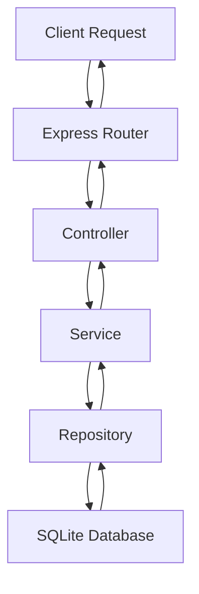
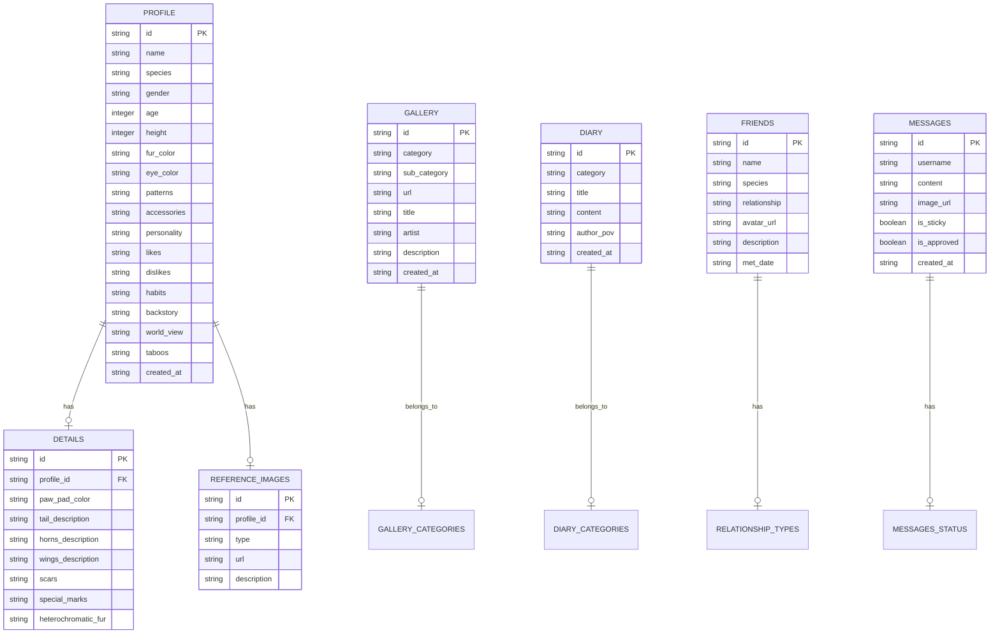

## 1. Architecture Design

```mermaid
flowchart LR
    subgraph Frontend
        A[React@18 + TypeScript] --> B[Vite]
        B --> C[TailwindCSS@3]
        C --> D[React Router]
        D --> E[Zustand State]
    end
    
    subgraph Backend
        F[Express@4] --> G[Node.js]
        G --> H[SQLite]
    end
    
    Frontend -->|API| Backend
```

## 2. Technology Description

* **Frontend**: React\@18 + TypeScript + Vite

* **Styling**: TailwindCSS\@3 + CSS Animations

* **Routing**: React Router DOM

* **State Management**: Zustand

* **Backend**: Express\@4 + Node.js + TypeScript

* **Database**: SQLite (轻量、无需额外服务)

* **Icons**: Lucide React

## 3. Route Definitions

| Route       | Purpose |
| ----------- | ------- |
| /           | 首页      |
| /profile    | 兽设档案页   |
| /gallery    | 作品图库    |
| /fursuit    | 兽装专栏    |
| /diary      | 日常随笔    |
| /friends    | 交友亲友墙   |
| /guestbook  | 留言板     |
| /commission | 约稿专区    |
| <br />      | <br />  |

## 4. API Definitions

### 4.1 Message API

| Method | Endpoint          | Description |
| ------ | ----------------- | ----------- |
| GET    | /api/messages     | 获取留言列表      |
| POST   | /api/messages     | 发布新留言       |
| PUT    | /api/messages/:id | 更新留言（置顶/审核） |
| DELETE | /api/messages/:id | 删除留言        |

### 4.2 Visitor API

| Method | Endpoint      | Description |
| ------ | ------------- | ----------- |
| GET    | /api/visitors | 获取访客统计      |
| POST   | /api/visitors | 增加访客计数      |

### 4.3 Data API

| Method | Endpoint             | Description |
| ------ | -------------------- | ----------- |
| GET    | /api/data/profile    | 获取兽设档案数据    |
| GET    | /api/data/gallery    | 获取图库数据      |
| GET    | /api/data/fursuit    | 获取兽装数据      |
| GET    | /api/data/diary      | 获取随笔数据      |
| GET    | /api/data/friends    | 获取亲友数据      |
| GET    | /api/data/commission | 获取约稿数据      |

## 5. Server Architecture Diagram



## 6. Data Model

### 6.1 Data Model Definition



### 6.2 Data Definition Language

#### Profile Table

```sql
CREATE TABLE profile (
    id TEXT PRIMARY KEY,
    name TEXT NOT NULL,
    species TEXT NOT NULL,
    gender TEXT,
    age INTEGER,
    height INTEGER,
    fur_color TEXT,
    eye_color TEXT,
    patterns TEXT,
    accessories TEXT,
    personality TEXT,
    likes TEXT,
    dislikes TEXT,
    habits TEXT,
    backstory TEXT,
    world_view TEXT,
    taboos TEXT,
    created_at TEXT DEFAULT CURRENT_TIMESTAMP
);
```

#### Details Table

```sql
CREATE TABLE details (
    id TEXT PRIMARY KEY,
    profile_id TEXT NOT NULL,
    paw_pad_color TEXT,
    tail_description TEXT,
    horns_description TEXT,
    wings_description TEXT,
    scars TEXT,
    special_marks TEXT,
    heterochromatic_fur TEXT,
    FOREIGN KEY (profile_id) REFERENCES profile(id)
);
```

#### Reference Images Table

```sql
CREATE TABLE reference_images (
    id TEXT PRIMARY KEY,
    profile_id TEXT NOT NULL,
    type TEXT NOT NULL,
    url TEXT NOT NULL,
    description TEXT,
    FOREIGN KEY (profile_id) REFERENCES profile(id)
);
```

#### Gallery Table

```sql
CREATE TABLE gallery (
    id TEXT PRIMARY KEY,
    category TEXT NOT NULL,
    sub_category TEXT,
    url TEXT NOT NULL,
    title TEXT,
    artist TEXT,
    description TEXT,
    created_at TEXT DEFAULT CURRENT_TIMESTAMP
);
```

#### Diary Table

```sql
CREATE TABLE diary (
    id TEXT PRIMARY KEY,
    category TEXT NOT NULL,
    title TEXT NOT NULL,
    content TEXT NOT NULL,
    author_pov TEXT DEFAULT 'OC',
    created_at TEXT DEFAULT CURRENT_TIMESTAMP
);
```

#### Friends Table

```sql
CREATE TABLE friends (
    id TEXT PRIMARY KEY,
    name TEXT NOT NULL,
    species TEXT,
    relationship TEXT NOT NULL,
    avatar_url TEXT,
    description TEXT,
    met_date TEXT
);
```

#### Messages Table

```sql
CREATE TABLE messages (
    id TEXT PRIMARY KEY,
    username TEXT NOT NULL,
    content TEXT NOT NULL,
    image_url TEXT,
    is_sticky BOOLEAN DEFAULT FALSE,
    is_approved BOOLEAN DEFAULT TRUE,
    created_at TEXT DEFAULT CURRENT_TIMESTAMP
);
```

#### Visitors Table

```sql
CREATE TABLE visitors (
    id TEXT PRIMARY KEY,
    count INTEGER DEFAULT 0,
    last_visit TEXT
);
```

